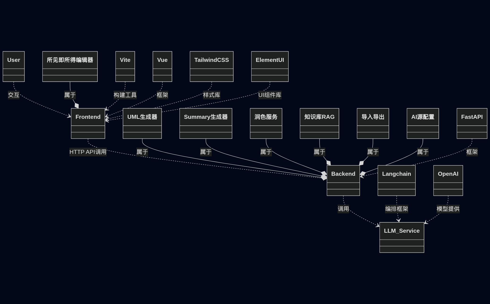

# FreeNote-Assistant 🗒️
## 需求分析 🚁

- 类 typora 功能，自由编辑markdown文本，“所见即所得”
- 支持对当前文档生成UML图 || 总结 summary
- 支持对当前文档进行润色修改
- 知识库检索，将当前文件夹所有文档作为知识库，通过检索回答问题（隐性功能：对话功能）
- 导入导出功能
- 支持用户自己添加ai源，配置api_key

## 技术选型 🧺

前端：`Vite` + `Vue` + `TailwindCSS`+`ElementUI`

后端：`FastAPI`

大模型：`Langchain` + `Openai`

